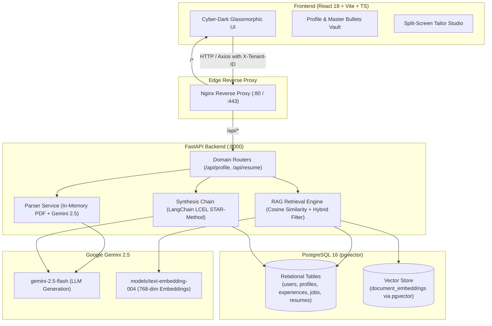

# 🚀 CareerCatalyst 2.0 — AI Resume Studio & Tailoring Platform

[](https://python.org)
[](https://fastapi.tiangolo.com)
[](https://react.dev)
[](https://www.typescriptlang.org)
[](https://github.com/pgvector/pgvector)
[](https://langchain.com)
[](https://docker.com)
[](https://cloud.oracle.com)

> **Multi-tenant AI-driven SaaS platform that uses LangChain LCEL, PostgreSQL `pgvector`, and Google Gemini 2.5 Flash to dynamically tailor resumes to target Job Descriptions with STAR-method bullet synthesis, ATS score match analytics, and instant LaTeX export.**

---

## 🌟 Live Demo
- **Live Cloud Deployment (HTTPS + Free SSL):** [https://career-catalyst.duckdns.org](https://career-catalyst.duckdns.org)
- **Interactive Swagger API Docs:** [https://career-catalyst.duckdns.org/docs](https://career-catalyst.duckdns.org/docs)

---

## 🏗️ System Architecture



---

## ⚡ Core Features

1. **📄 In-Memory Resume Ingestion & Parsing:**
   - Drag-and-drop PDF extraction with zero disk retention for candidate privacy.
   - Structured JSON entity extraction using Google Gemini into Contact, Skills, Experiences, Education, and Certifications.
2. **🎯 Intelligent Job Description Deconstruction:**
   - Extracts hard requirements, core tech stack, seniority indicators, and required competencies.
3. **🔍 Hybrid RAG Retrieval Engine:**
   - Converts JD criteria into composite embedding queries using `models/text-embedding-004`.
   - Executes multi-tenant vector cosine similarity searches against past candidate achievements with graceful relational database fallback.
4. **✍️ STAR-Method Tailoring Synthesis:**
   - Synthesizes tailored bullet points adhering strictly to **Situation, Task, Action, and Result (STAR)** with quantified metrics.
5. **📊 Real-Time ATS Gap Scoring:**
   - Computes dynamic ATS match scores (0–100%) and highlights keyword gaps.
6. **📝 Visual Printable Preview & One-Click LaTeX Export:**
   - Split-screen studio with formatted paper preview (`@media print` ready) and direct LaTeX source export for Overleaf.
7. **🔒 Strict Multi-Tenant Data Isolation:**
   - Complete partition across all relational queries and vector search metadata filters via `tenant_id` and `user_id`.

---

## 🛠️ Technology Stack

| Layer | Technology | Purpose |
|---|---|---|
| **Frontend** | React 18, Vite, TypeScript | Modern reactive Single Page Application |
| **Styling** | Vanilla CSS Design System | Curated cyber-dark glassmorphism, Google Fonts (*Outfit* & *Inter*) |
| **Backend** | Python 3.11, FastAPI, Uvicorn | High-throughput async REST API |
| **AI / RAG** | LangChain Core & LCEL, Google Gemini | LLM structured parsing, embeddings, and prompt chains |
| **Vector DB** | PostgreSQL 16 + `pgvector` | Relational tables and 768-dim vector embeddings |
| **Proxy / Web** | Nginx Alpine | Unified reverse proxy, gzip compression, SSL termination |
| **Infrastructure** | Oracle Cloud Infrastructure (OCI) | Ampere A1 ARM64 Compute (4 OCPUs, 24 GB RAM) |
| **Containers** | Docker & Docker Compose v2 | Multi-container reproducible production stack |

---

## 🚀 Quickstart & Local Development

### 1. Clone the repository
```bash
git clone https://github.com/Priyanshu98156/career-catalyst-2.0.git
cd career-catalyst-2.0
```

### 2. Configure Environment Variables
Copy the template and add your Gemini API Key:
```bash
cp .env.example .env
```
Edit `.env`:
```env
GEMINI_API_KEY=your_gemini_api_key_here
POSTGRES_USER=postgres
POSTGRES_PASSWORD=your_secure_password
POSTGRES_DB=careercatalyst
DATABASE_URL=postgresql+psycopg://postgres:your_secure_password@db:5432/careercatalyst
```

### 3. Run with Docker Compose
```bash
docker compose up -d --build
```

Access the services:
- **Frontend App:** [http://localhost:5173](http://localhost:5173) (or [http://localhost](http://localhost) in production)
- **FastAPI Documentation:** [http://localhost:8000/docs](http://localhost:8000/docs)
- **Health Check:** [http://localhost:8000/health](http://localhost:8000/health)

---

## ☁️ Production Deployment on OCI (Always Free)

For complete step-by-step instructions on setting up an Oracle Cloud Ampere A1 instance, configuring VCN security lists, iptables, and SSL with Certbot, refer to:
👉 **[DEPLOYMENT_OCI.md](DEPLOYMENT_OCI.md)**

---

## 🧪 Running Automated Tests
```bash
# Run unit tests for parsing, RAG retrieval, and synthesis
python -m pytest backend/tests/ -v
```

---

## 📜 License
Distributed under the MIT License. See `LICENSE` for more information.
